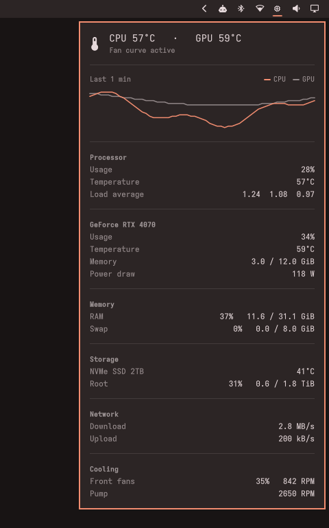

# omarchy-sysmon

A system monitor for the [Omarchy](https://omarchy.org) bar: one icon, and a card with CPU, GPU, memory, storage, network and fan readings plus a graph of recent temperatures, styled like Omarchy's own panels.



*Click the icon in the bar to open the card. The hardware shown is a demo.*

- **Detects your hardware at runtime.** Intel and AMD CPU temperatures, NVIDIA and AMD GPUs, NVMe and SATA drives, and every fan your motherboard driver exposes. Nothing is hard-coded for one machine.
- **Read-only.** The card never changes anything. Optional fan control lives in [`fan-control/`](fan-control/) and is installed separately.
- **Leaves a sleeping NVIDIA GPU asleep** instead of waking it every few seconds to read its temperature, which matters on laptops.

## Install

```sh
omarchy plugin add https://github.com/RonildoBraga/omarchy-sysmon --enable
```

The icon appears in the right section of the bar. Click it for the card, or right-click it for btop.

Needs Omarchy 4 for its plugin system, `jq` (included with Omarchy), and `nvidia-smi` if you have an NVIDIA GPU.

## What it shows

- **Temperature history:** a graph of CPU and GPU temperature over the last few minutes. It's kept in memory, so it starts empty whenever the shell restarts.
- **Processor, graphics and memory:** usage, temperatures, load average, video memory and power draw.
- **Storage:** each drive's temperature, highlighted once it passes the drive's own warning threshold, and usage for the filesystems in `disks`, highlighted above 90%. A path on a filesystem that's already listed, such as `/home` on a single-partition install, isn't repeated. NVMe drives work out of the box. SATA drives need the kernel's `drivetemp` module: `sudo modprobe drivetemp`, and add `drivetemp` to a file in `/etc/modules-load.d/` to keep it after a reboot.
- **Network:** download and upload speed across your physical network interfaces. Docker bridges, VPN tunnels and loopback are skipped, because their traffic already passes through a physical interface.
- **Cooling:** fan speeds. See [Naming fans](#naming-fans).

## Settings

Settings go on the widget's entry in `~/.config/omarchy/shell.json`, so they stay on your machine and survive plugin updates.

| Setting | Default | |
|---|---|---|
| `gpu` | `auto` | `auto`, `nvidia`, `amd` or `none` |
| `refreshIntervalSec` | `3` | seconds between readings |
| `warnTemp` | `80` | the icon turns to the urgent colour when the CPU or GPU reaches this (°C) |
| `fans` | `[]` | names for your fans, see below |
| `showHistory` | `true` | show the temperature graph |
| `historyMinutes` | `5` | minutes of history in the graph (1 to 60) |
| `showStorage` | `true` | show drive temperatures and disk usage |
| `disks` | `["/", "/home"]` | filesystems to show usage for |
| `showNetwork` | `true` | show download and upload speed |

### Naming fans

Until you name them, the card lists each spinning fan as `chip · fan N`, for example `nct6798 · fan 1`. That label tells you what to write:

```json
{
  "id": "ronildobraga.sysmon",
  "fans": [
    { "label": "Front fans", "chip": "nct6798", "fan": 1, "pwm": 1 },
    { "label": "Pump", "chip": "nct6798", "fan": 4 }
  ]
}
```

- `fan` is the number from the card. `chip` can be left out if only one chip has that fan number.
- `pwm` is optional. Set it to show the speed the controller is asking for next to the RPM. `pwmN` does not always drive `fanN`; [`fan-control/sysmon-fand-detect`](fan-control/README.md#1-identify-your-hardware) helps you check.
- Named fans are always listed, so a stopped pump shows up as `stopped` in the urgent colour instead of disappearing.

## Keybinding

To toggle the card from the keyboard, copy the line from [`examples/bindings.lua`](examples/bindings.lua) into `~/.config/hypr/bindings.lua`.

## Fan control (optional)

Motherboard firmware can only drive fans from the sensors it can see, which usually means the CPU. If your case fans should also react to a hot GPU, [`fan-control/`](fan-control/) contains `sysmon-fand`, a small daemon that drives PWM fan headers from CPU and GPU temperature curves.

It runs as root and writes directly to fan hardware, so `omarchy plugin add` does **not** install it. Read [`fan-control/README.md`](fan-control/README.md) before using it. While it runs, the card shows "Fan curve active".

## Development

```sh
test/run
```

The tests run the collector and the daemon against fake sysfs and procfs trees in `test/fixtures`, so they don't need any particular hardware. On an Omarchy system they also run `omarchy plugin validate`.

To try a change, copy the folder to `~/.config/omarchy/plugins/ronildobraga.sysmon/` and run `omarchy restart shell` (saving a file hot-reloads data but not changed QML functions).

Two things to know when editing:

- **Never declare a property named `data` in `Panel.qml`.** It shadows `Item`'s list of children, and the widget silently stops rendering. The tests check for this.
- **If you fork it,** change `id` in `manifest.json` and `moduleName` in `Panel.qml` together. The tests check that they match.

## License

[MIT](LICENSE)
